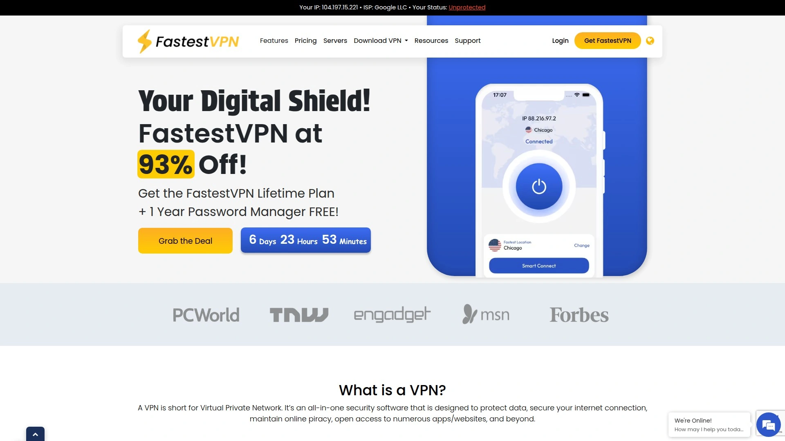
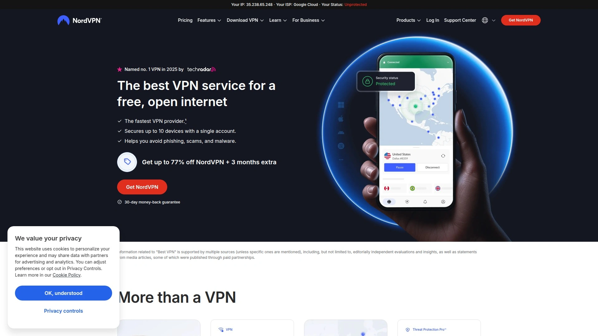
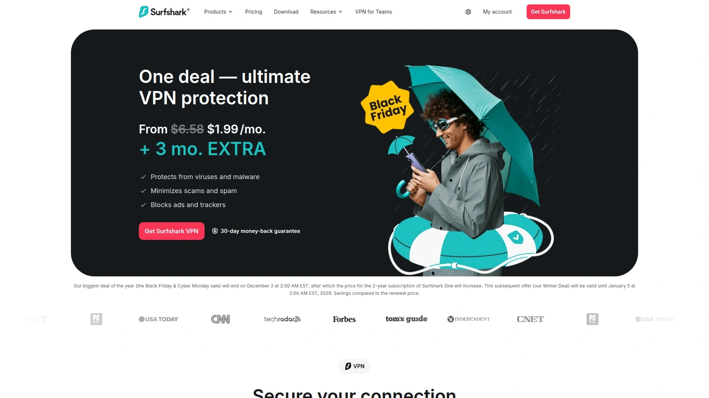
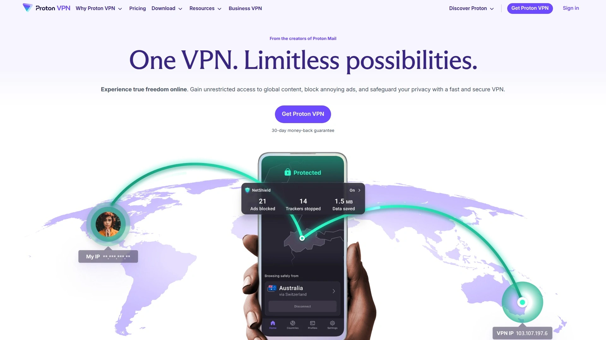
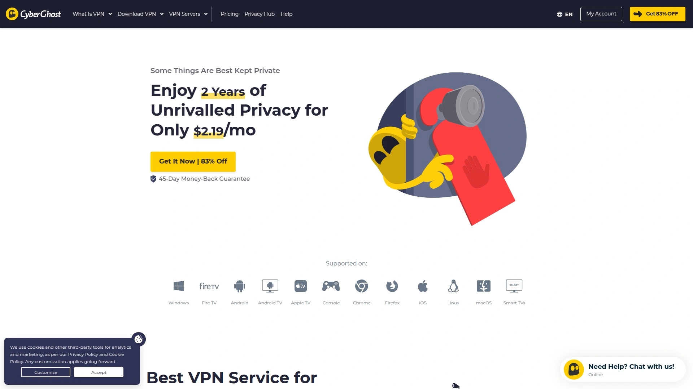
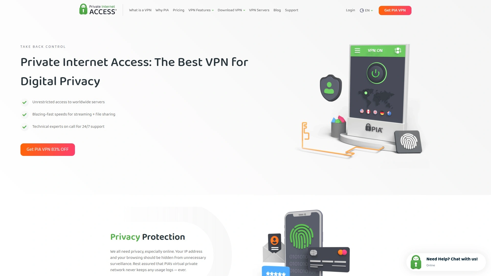
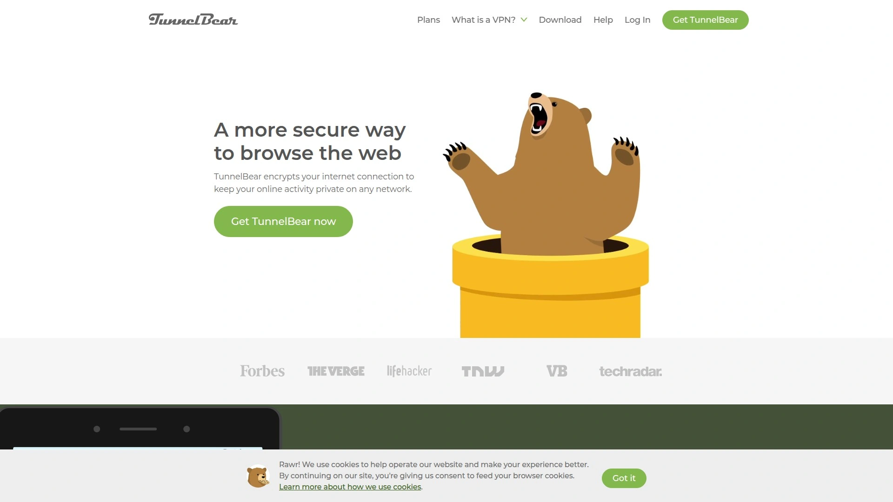

# 2025's Top 10 Best VPN Services

When your internet provider throttles streaming speeds or websites track every click, basic browsing becomes surveillance. Geographic restrictions lock you out of content you want to access. Public WiFi networks expose your data to anyone with basic packet-sniffing tools. Modern VPN services solve these problems by encrypting your connection, masking your location, and restoring control over your digital footprint.

This compilation covers platforms that handle everyday privacy needs: secure streaming across borders, anonymous browsing without activity logs, protection on untrusted networks, and fast connections that don't sacrifice speed for security. Each service brings different strengths—from unlimited device support to specialized servers optimized for specific tasks.

***

## **[FastestVPN](https://fastestvpn.com)**

Budget-friendly lifetime subscriptions with audited no-logs policy and multi-device coverage.

FastestVPN stands out by offering genuinely affordable pricing that doesn't follow the subscription treadmill most VPNs impose. The yearly plan drops to just 83 cents per month when billed biennially, while lifetime subscriptions lock in access for a one-time payment of around $40. This covers up to 10 devices simultaneously, making it practical for households managing phones, laptops, tablets, and smart TVs under one account.

Speed performance sits well above what most budget services deliver. Testing showed 730 Mbps average speeds using the WireGuard protocol—more than sufficient for 4K streaming, online gaming, or large file downloads. While not technically the fastest on the market, the name isn't misleading for practical purposes.

Security infrastructure includes AES 256-bit encryption, streaming-optimized servers for platforms like BBC iPlayer and ITVX, and P2P-dedicated servers for safe torrenting. The independently audited no-logs policy confirms FastestVPN doesn't track your browsing history, connection times, or IP addresses. Being based in the Cayman Islands adds jurisdictional privacy advantages.

The server network spans 50+ countries with 800+ servers—smaller than enterprise competitors but adequate for most users. Apps work across Windows, macOS, iOS, Android, and routers with straightforward interfaces designed for beginners. A built-in password manager adds extra value at no additional cost.

Some limitations exist: Netflix unblocking proved inconsistent in testing, customer support response times lag behind premium alternatives, and the lifetime deal sustainability raises questions about long-term service quality. However, for users prioritizing cost control alongside solid fundamentals, FastestVPN delivers transparent value.

***

## **[NordVPN](https://nordvpn.com)**

Industry-leading security with threat protection, 8,200+ servers, and proprietary protocols.

NordVPN consistently ranks first in comprehensive VPN evaluations due to its combination of performance, security depth, and feature innovation. The platform operates 8,200+ ultra-secure servers across 127 countries—the widest reach among tested VPN services. This extensive network ensures fast connection speeds regardless of your physical location.

Threat Protection Pro functions as antivirus-grade security that automatically blocks malicious websites, prevents malware downloads, and filters out ads and trackers before they reach your device. AI enhancement makes real-time threat detection more responsive. The independently audited no-logs policy undergoes third-party verification annually, more frequently than competitors.

Three proprietary protocols give NordVPN technical advantages. NordLynx builds upon WireGuard to deliver blazing speeds with ChaCha20 encryption and post-quantum protection—future-proofing against quantum computing threats. OpenVPN provides gold-standard 256-bit AES encryption for maximum security. NordWhisper specifically targets restrictive network environments, bypassing office and school VPN blocks without noticeably slowing connections.

Advanced features include double VPN routing through two separate servers for dual encryption layers, Meshnet for bypassing password-sharing restrictions by connecting to your home IP from anywhere, Dark Web Monitor for credential breach alerts, and dedicated IP options for stable access. SmartPlay technology seamlessly unblocks streaming services like Netflix with reliable speeds that eliminate buffering.

The main limitation is a 10-device simultaneous connection cap that might constrain larger households. Current pricing sits at $3.09 monthly for two-year Basic plans, with Plus and Complete tiers adding password managers and file encryption. For users seeking enterprise-grade security without enterprise complexity, NordVPN justifies its premium position.

---

## **[ExpressVPN](https://www.expressvpn.com)**

Lightning-fast Lightway protocol with best-in-class encryption and proven zero-logs verification.

ExpressVPN built its reputation on speed without compromise. The proprietary Lightway Turbo protocol delivers consistently fast connections that routinely max out testing lines above 950 Mbps. This makes it ideal for bandwidth-intensive activities like 4K streaming, large file transfers, or competitive gaming where milliseconds matter.

Privacy protection operates at institutional levels. The strict no-logs policy means ExpressVPN never records your browsing activity, connection timestamps, IP addresses, or DNS queries. This commitment has been validated through independent audits and real-world legal cases where authorities found no user data to seize. TrustedServer technology runs all servers on RAM rather than hard drives, physically erasing all data with every reboot.

Network infrastructure spans 3,000+ servers in 94 countries, with all locations operating under the same high-speed standards. The Network Lock kill switch automatically blocks all internet traffic if your VPN connection drops, preventing accidental data leaks during power flickers or network changes. Tracker and ad blocking through ExpressVPN Threat Manager stops apps from phoning home with your activity data.

Anonymous payment options let you sign up with Bitcoin via BitPay using only an email address, keeping your identity completely separate from your subscription. Shared IP addresses make it impossible to trace online activity back to individual users. Apps across all platforms feature clean interfaces that prioritize usability without sacrificing advanced customization.

The service supports up to 5 simultaneous device connections, which may feel restrictive compared to unlimited-device competitors. Pricing sits at premium levels, though the 30-day money-back guarantee provides risk-free testing. For users demanding maximum speed paired with uncompromising privacy, ExpressVPN remains the benchmark.

***

## **[Surfshark](https://surfshark.com)**

Unlimited simultaneous device connections with CleanWeb ad-blocking and budget-friendly pricing.

Surfshark solves a common frustration by allowing unlimited devices on every subscription plan—no artificial caps forcing you to choose which gadgets get protection. This makes it perfect for families or professionals managing multiple laptops, phones, tablets, smart TVs, and routers under one account. Performance remains consistent regardless of how many devices connect simultaneously, with no bandwidth throttling.

CleanWeb blocks YouTube ads and malware when connected, creating cleaner browsing experiences while enhancing security. The Surfshark VPN Accelerator technology improves speeds by up to 400% on long-distance connections, solving the typical slowdown issue with remote servers. Testing confirmed reliable unblocking of Netflix and other streaming platforms.

Server infrastructure includes 3,200+ globally distributed servers optimized for different use cases. Privacy-focused open-source software allows independent security audits by anyone, building trust through transparency. A free encrypted email account comes bundled with subscriptions, adding communication privacy at no extra cost.

NoBorders mode helps bypass VPN restrictions in countries with heavy internet censorship by obfuscating VPN traffic to appear as regular HTTPS connections. MultiHop routes your connection through multiple countries simultaneously for additional anonymity. RAM-only servers ensure no data persists after sessions end.

Pricing strategies make Surfshark one of the most affordable premium VPNs while maintaining feature parity with more expensive alternatives. The unlimited device policy delivers exceptional value for households that would otherwise need multiple accounts. For users wanting enterprise features without per-device costs, Surfshark provides refreshing flexibility.

***

## **[Proton VPN](https://protonvpn.com)**

Swiss-based privacy with Secure Core architecture and free tier with no data limits.

Proton VPN operates under Switzerland's exceptionally strong data protection laws, positioning it outside US and EU jurisdictions and beyond the reach of 5/9/14 Eyes intelligence-sharing networks. This legal foundation enables an audited no-logs policy that never records your browsing history, session lengths, IP addresses, or any identifiable metadata.

Secure Core architecture routes traffic through privacy-hardened servers in Switzerland, Iceland, and Sweden before exiting to your final destination. This multi-hop configuration protects against network-level attacks even if exit servers become compromised. The company was founded by CERN scientists who created Proton Mail, bringing institutional security expertise to VPN development.

What sets Proton apart is its genuinely functional free tier that doesn't impose data caps—unusual among quality VPNs. Free users access servers in three countries with reasonable speeds, making it viable for privacy-conscious users on tight budgets. Paid plans unlock the full global network of high-speed 10 Gbps servers, Secure Core protection, and advanced features.

All Proton software is open-source, allowing independent security researchers to audit code for vulnerabilities or backdoors. Independent security firm Securitum verified the no-logs claims through comprehensive auditing. Integration with Proton Mail and Proton Drive creates an encrypted ecosystem for users seeking comprehensive digital privacy.

Recent concerns about proposed Swiss surveillance law changes prompted Proton to begin moving physical infrastructure to other European countries with stronger privacy guarantees, though Swiss legal protections remain their operational foundation. For users prioritizing legal privacy protections alongside technical security, Proton VPN offers institutional-grade trust.

***

## **[CyberGhost](https://www.cyberghostvpn.com)**

Streaming-optimized servers for 50+ services with NoSpy data centers and user-friendly apps.

CyberGhost eliminates guesswork by organizing its 11,300+ servers into purpose-specific categories. Dedicated streaming menus show exactly which servers work with Netflix, BBC iPlayer, HBO Max, Prime Video, Hulu, and 40+ other platforms—no trial-and-error required. Each streaming server is optimized for that specific service, preventing the blocking issues common with generic servers.

Torrenting enthusiasts get clearly labeled P2P servers located in countries with torrent-friendly laws, ensuring safe downloads without legal concerns. Gaming servers display latency metrics so you can choose the lowest-ping option for competitive play. This organization makes CyberGhost exceptionally beginner-friendly.

NoSpy servers represent CyberGhost's highest security tier—self-owned and managed data centers in Romania that no third parties can access. Romania's strong privacy laws and position outside surveillance alliances add jurisdictional benefits. The ironclad no-logs policy means even if data requests arrive, nothing exists to share.

Smart Rules automation lets you configure CyberGhost to connect automatically when joining specific WiFi networks, accessing certain websites, or launching particular applications. This saves the hassle of manually toggling VPN protection. The automatic kill switch blocks internet traffic if your VPN drops, preventing accidental exposure on unsecured networks.

Plans support up to 7 simultaneous device connections with apps for every major platform including routers and smart TVs. Pricing sits in the mid-range with frequent promotional discounts, while the 45-day money-back guarantee gives extended testing time. For users frustrated by streaming blocks or complex server selection, CyberGhost's organized approach removes friction.

***

## **[Private Internet Access](https://www.privateinternetaccess.com)**

Open-source transparency with unlimited device support and customizable encryption settings.

Private Internet Access (PIA) has maintained its position as a trusted VPN for over 10 years through radical transparency. Every aspect of the software is open-source, allowing anyone to inspect or modify the code to verify there are no hidden backdoors or data collection mechanisms. This community-auditable approach builds trust that closed-source alternatives cannot match.

The server infrastructure spans 90+ countries with NextGen hardware featuring 10Gbps network cards for maximum connection speeds. PIA owns and operates colocated servers, ensuring third parties never access the physical equipment. All servers run on RAM, erasing data with every reboot.

Encryption customization gives power users granular control over their security settings while maintaining sensible defaults for beginners. Support for both OpenVPN and WireGuard protocols lets you choose between maximum security or fastest speeds based on your needs. Per-network settings automatically enable VPN protection when connecting to unsecured WiFi networks, protecting you on autopilot.

The automatic kill switch prevents data leaks if your connection drops unexpectedly. MACE ad and malware blocking cleans up browsing experiences while enhancing security. A free email breach monitor checks if your address appears in known security breaches, alerting you to compromised accounts.

PIA supports unlimited simultaneous device connections on all plans—rare for VPNs in this price range. The strict no-logs policy has been tested in real legal cases where PIA had no user data to provide authorities. For technically inclined users wanting verified security through open-source transparency, PIA delivers proven reliability.

***

## **[IPVanish](https://www.ipvanish.com)**

Self-owned server infrastructure with unlimited connections and customizable automation rules.

IPVanish differentiates itself by owning and managing all its server hardware rather than renting from third-party data centers. This self-managed infrastructure provides greater control over security and performance compared to VPNs dependent on external providers. The network spans 2,400+ servers across 140 countries.

On Demand automation connects you to VPN protection automatically when specific conditions trigger—joining public WiFi, accessing particular websites, or launching select applications. This eliminates the need to manually remember to enable your VPN in vulnerable situations. Split tunneling gives precise control over which apps route through the encrypted VPN and which use direct connections for optimized speed.

Threat Protection blocks ads, trackers, malicious websites, and cookies across multiple platforms using custom DNS addresses. Traffic obfuscation scrambles OpenVPN connections to bypass VPN-blocking firewalls in restrictive environments like China, schools, or corporate networks. SOCKS5 proxy support provides IP masking without encryption for torrenting scenarios where speed matters more than full security.

Advanced subscription tiers include up to 1TB of Livedrive encrypted cloud storage protected by the same AES-256 encryption as your VPN connection. This creates a secure alternative to Dropbox or Google Drive. All plans support unlimited simultaneous device connections, removing artificial limits.

The independently audited no-logs policy confirms IPVanish doesn't track user activity. WireGuard, IKEv2, and OpenVPN protocol support gives flexibility for different security needs. Monthly pricing runs high at $12.99, but two-year subscriptions drop to $2.19 per month. For users wanting self-managed infrastructure and powerful automation, IPVanish delivers professional-grade control.

---

## **[TunnelBear](https://www.tunnelbear.com)**

Friendly interface with functional free plan and servers in 47 countries.

TunnelBear stands out through approachable design that makes VPN technology feel accessible rather than intimidating. The minimalist interface uses clear language and playful bear-themed visuals to guide users through connection choices without requiring technical knowledge. This makes it ideal for VPN newcomers or users who want privacy without complexity.

The free plan provides surprising functionality with access to servers in all 47 available countries—more location options than most free VPNs offer. The limitation is a 500MB monthly data cap that resets each month without rollover. This works for light browsing, occasional banking on public WiFi, or testing the service before committing to paid plans.

Premium subscriptions remove data restrictions entirely, with three-year plans dropping to $3.33 monthly. Teams plans add centralized billing and admin controls for businesses at $5.75 per user monthly. All tiers support unlimited simultaneous device connections.

VigilantBear functions as an always-on kill switch that blocks internet traffic if your VPN connection drops. GhostBear obfuscates VPN traffic to make it less detectable by firewalls or ISPs that block VPN usage. SplitBear split tunneling lets you choose which apps use the encrypted VPN tunnel.

Canadian ownership places TunnelBear under Five Eyes jurisdiction, a potential concern for users seeking maximum legal privacy. The lack of money-back guarantee means you can't get refunds after purchase, though the free tier allows risk-free testing. PayPal isn't accepted, limiting payment flexibility. For users prioritizing ease-of-use over advanced features, TunnelBear removes intimidation from online privacy.

***

## **[Mullvad VPN](https://mullvad.net)**

Anonymous registration with cash payment options and flat €5 monthly pricing.

Mullvad takes privacy to its logical extreme by allowing completely anonymous registration without requiring email addresses, names, phone numbers, or any personal information. You receive a randomly generated account number—that's your only identifier. This ensures zero linkage between your identity and VPN activity.

Payment anonymity reaches unprecedented levels through cash-by-mail acceptance. Send €5 in an envelope without a return address, and your account activates with absolutely no paper trail connecting you to the service. For users facing genuine surveillance threats or living under authoritarian regimes, this level of anonymity is unmatched.

Security infrastructure includes WireGuard and OpenVPN protocols with AES 256 encryption. RAM-based servers ensure no data persists after sessions. Lockdown mode and obfuscation features help bypass restrictive firewalls. The no-logs policy undergoes regular independent audits, with a 2020 Cure53 security audit finding no critical vulnerabilities.

Mullvad operates 700+ servers in 49 countries—smaller than major competitors but adequate for most use cases. Swedish headquarters places it under 14 Eyes intelligence jurisdiction, though the anonymous registration and no-logs practice render this largely moot since there's nothing to request.

Pricing remains flat at €5 monthly with no discount tiers or subscription tricks. This consistency since 2009 demonstrates business sustainability rather than promotional gimmicks. The tradeoff is that Mullvad deliberately avoids streaming optimization—Netflix and similar services don't work reliably. For privacy purists willing to sacrifice streaming convenience for maximum anonymity, Mullvad offers uncompromising principles.

***

## FAQ

**Can VPNs actually hide my browsing from my internet provider?**

Yes, VPNs encrypt all traffic between your device and the VPN server, making it impossible for your ISP to see which websites you visit or what you download. They only see encrypted data flowing to the VPN server's IP address. This prevents ISP throttling based on activity type and stops data collection for advertising profiles.

**Do I need a VPN if I only use HTTPS websites?**

HTTPS encrypts the content of your communications but still exposes which domains you visit, when you visit them, and metadata about your browsing patterns. Your ISP, network administrators, and governments can still monitor and log this information. VPNs add a layer that hides your browsing destinations and usage patterns completely.

**Will a VPN slow down my internet connection significantly?**

Modern premium VPNs cause minimal slowdown, typically 5-15% speed reduction. Services like ExpressVPN and NordVPN often maintain 90%+ of base speeds when connecting to nearby servers. The encryption overhead is offset by bypassing ISP throttling, sometimes resulting in faster speeds for specific activities like streaming or torrenting.

***

## Conclusion

Online privacy shouldn't require technical expertise or accepting surveillance as inevitable. Modern VPNs restore control over your digital footprint through proven encryption, jurisdictional advantages, and features that address real-world privacy threats. Whether you're accessing content across borders, protecting data on public networks, or simply reclaiming anonymity from pervasive tracking, these services provide practical solutions at transparent pricing.

For users seeking lifetime value with independently audited security fundamentals at budget-friendly pricing, **[FastestVPN](https://fastestvpn.com)** delivers solid protection without subscription fatigue. The platform handles everyday privacy needs—streaming, anonymous browsing, public WiFi security—through straightforward apps that prioritize accessibility over complexity.
